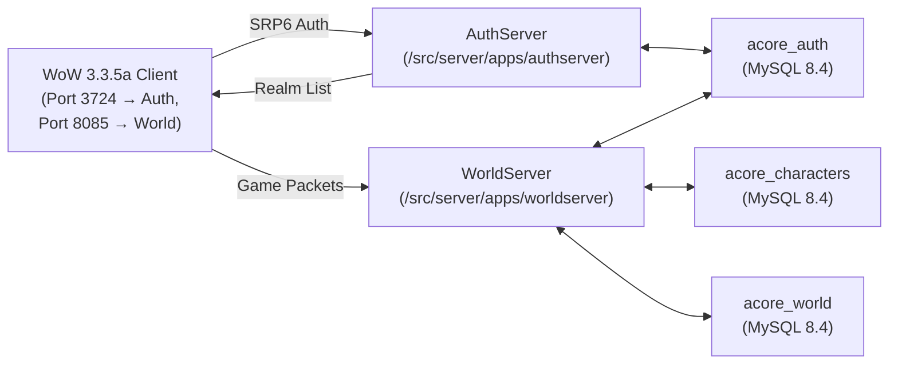
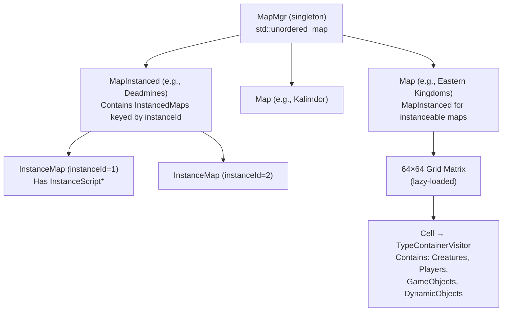
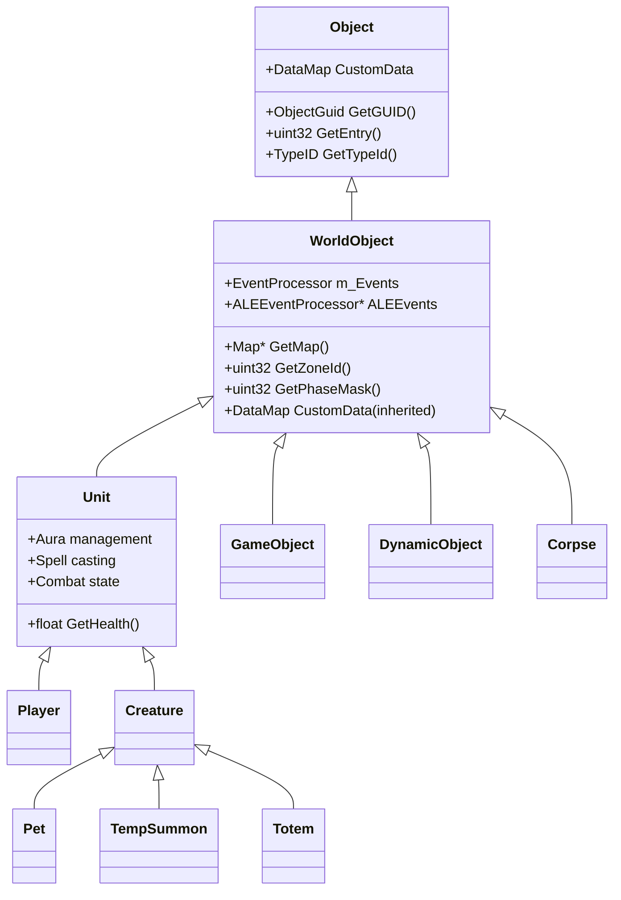
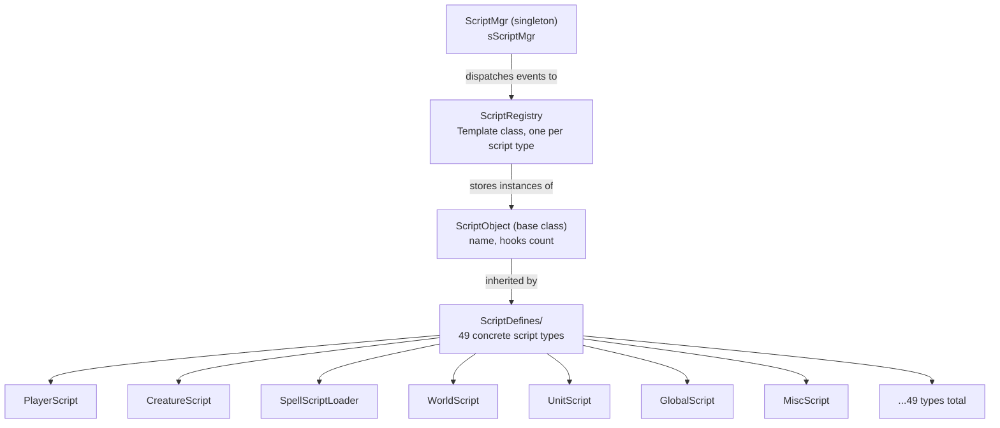
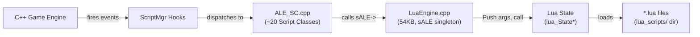

# AzerothCore 3.3.5a — Executive Architectural Summary

> **Purpose:** This document documents the existing vanilla engine, its structural boundaries, its intended extension patterns, and explains *how* a developer would modify it. It deliberately does **not** prescribe game design.

---

## Table of Contents

1. [High-Level Topology](#1-high-level-topology)
2. [The Engine Loop & State Management](#2-the-engine-loop--state-management)
3. [The Extension Boundary](#3-the-extension-boundary-how-it-wants-to-be-modified)
4. [Codebase Navigation Guide](#4-codebase-navigation-guide)
5. [Architectural Pain Points & Callouts](#5-architectural-pain-points--callouts)

---

## 1. High-Level Topology

### 1.1 The Three-Process Model



| Component | Role |
|---|---|
| **AuthServer** | Handles SRP6 authentication, account management, and serves the realm list. Lightweight; no game logic. Connects only to `acore_auth`. |
| **WorldServer** | The monolithic game engine. Manages all gameplay: networking, physics, AI, scripting, persistence. Connects to all three databases. |
| **WoW Client** | The unmodified 3.3.5a client. Connects to AuthServer (TCP 3724) for login, then to WorldServer (TCP 8085) for gameplay. |

### 1.2 The Database Triad

| Database | Purpose | Access Pattern |
|---|---|---|
| **`acore_auth`** | Accounts, realm list, bans, IP tracking. Shared across all realms. | Low-frequency reads/writes. Mostly `LoginDatabase.DirectExecute()` (sync). |
| **`acore_characters`** | Player-specific persistent state: inventory, quest progress, talents, social data, guild membership. Per-realm. | High-frequency async writes via `CharacterDatabase.Execute()` (async). Sync reads during player load. |
| **`acore_world`** | Static game content: creature templates, spell definitions, item templates, loot tables, quest definitions. | Loaded into memory at startup via sync bulk reads. Rarely written to at runtime (mostly for GM commands or custom data). |

### 1.3 Database Connection Architecture

Defined in [DatabaseWorkerPool.h](/src/server/database/Database/DatabaseWorkerPool.h) and instantiated in [DatabaseEnv.h](/src/server/database/Database/DatabaseEnv.h):

```cpp
// Three global singletons — one per database
AC_DATABASE_API extern DatabaseWorkerPool<WorldDatabaseConnection> WorldDatabase;
AC_DATABASE_API extern DatabaseWorkerPool<CharacterDatabaseConnection> CharacterDatabase;
AC_DATABASE_API extern DatabaseWorkerPool<LoginDatabaseConnection> LoginDatabase;
```

Each `DatabaseWorkerPool` maintains **two internal connection pools**:

| Pool | Index | Purpose |
|---|---|---|
| **Async** | `IDX_ASYNC` | Services fire-and-forget `Execute()` and `AsyncQuery()` calls. Work is enqueued to a `ProducerConsumerQueue` and processed by background worker threads. |
| **Sync** | `IDX_SYNCH` | Services `DirectExecute()` and `Query()` which block the calling thread. |

**Key Methods:**

| Method | Blocking? | Thread-Safe? | Use Case |
|---|---|---|---|
| `Execute(stmt)` | No | Yes (queued) | Non-critical writes (player save, position update) |
| `DirectExecute(sql)` | **Yes** | Yes (grabs sync conn) | Startup queries, rare admin operations |
| `Query(sql)` | **Yes** | Yes (grabs sync conn) | Startup data loading, one-off reads |
| `AsyncQuery(stmt)` | No | Yes (queued) | Reads where you need a callback with results |
| `CommitTransaction(trans)` | No | Yes (queued) | Batched async writes |
| `DirectCommitTransaction(trans)` | **Yes** | Yes | Transactional writes that must complete before proceeding |

> [!WARNING]
> The world update loop explicitly warns about sync queries during runtime via `WarnAboutSyncQueries(true)`. Using `DirectExecute()` or `Query()` on the main world thread **will cause frame stalls**.

---

## 2. The Engine Loop & State Management

### 2.1 The World Update Loop

The heartbeat of the server. Defined in [Main.cpp:557-604](/src/server/apps/worldserver/Main.cpp#L557-L604):

```
┌──────────────────────────────────────────────────┐
│  WorldUpdateLoop()                                │
│  while (!World::IsStopped())                      │
│  {                                                │
│    diff = getMSTimeDiff(prevTime, currTime);       │
│    if (diff < MinWorldUpdateTime) sleep; continue; │
│    sWorld->Update(diff);      ←── THE TICK         │
│    prevTime = currTime;                            │
│  }                                                │
└──────────────────────────────────────────────────┘
```

- `MinWorldUpdateTime` (config, default `1ms`) sets the **minimum tick interval**. In practice, a tick takes as long as `World::Update()` needs.
- A `FreezeDetector` runs on a separate ASIO timer (1s interval). If the main loop counter hasn't incremented within `MaxCoreStuckTime` (default 60s), it **ABORTs the process**.

### 2.2 What Happens in `World::Update(diff)`

The `World::Update()` method (defined via the [IWorld](/src/server/game/World/IWorld.h) interface, implemented in `World.cpp`) orchestrates all per-tick work:

```
World::Update(diff)
├── Process async query callbacks (_queryProcessor)
├── Update game time
├── Update IntervalTimers: uptime, events, DB cleanup, autobroadcast, mailbox, ping, who-list
├── sWorldSessionMgr->UpdateSessions(diff)    // Process queued packets per-player
├── sMapMgr->Update(diff)                     // THE BIG ONE — updates all maps/grids/entities
├── sBattlegroundMgr->Update(diff)
├── sOutdoorPvPMgr->Update(diff)
├── sScriptMgr->OnWorldUpdate(diff)           // Hook for scripts/modules
├── Process CLI commands
├── Process mail queue
├── Handle shutdown timers
└── ...
```

> [!IMPORTANT]
> **`sMapMgr->Update(diff)` is the single most expensive call.** It updates every active map, every loaded grid, every creature AI, every spell aura, and every player session handler. Any heavy custom logic that runs per-tick should be aware of this call chain.

### 2.3 MapManager → Map → Grid Hierarchy



**Key architecture from [MapMgr.h](/src/server/game/Maps/MapMgr.h) and [Map.h](/src/server/game/Maps/Map.h):**

- **MapMgr** is a singleton (`sMapMgr`) holding an `unordered_map<uint32 mapId, Map*>`.
- A **Map** represents a single world map (continent, dungeon template).
- **MapInstanced** is a Map subclass for instanceable maps; it spawns individual **InstanceMap** objects per group/player, each with a unique `instanceId`.
- **InstanceMap** holds an `InstanceScript*` for boss state tracking and scripted encounters.
- **BattlegroundMap** is a Map subclass for arenas/BGs.
- The `Map::Update()` method has the signature `virtual void Update(const uint32 diff, const uint32 s_diff, bool thread)`.

### 2.4 Grid Loading, Unloading, and Entity Lifecycle

Maps use a **64×64 grid** where each cell is approximately **533.33 yards**. The visible range constant is `166.0f` (defined in [ScriptObject.h](/src/server/game/Scripting/ScriptObject.h#L40)).

- **Lazy Loading:** Grids are loaded only when a player enters them (`EnsureGridLoaded`). `GridObjectLoader` spawns database-defined creatures and gameobjects.
- **Unloading:** When no players are within a grid for `MIN_UNLOAD_DELAY`, it gets unloaded. All creatures/GOs in the grid are despawned and their memory freed.
- **Visibility:** A `Visitor` pattern (via `TypeContainerVisitor`) iterates objects within visible range to send update packets.
- **Relocation:** When an entity moves, `Map::PlayerRelocation()` / `CreatureRelocation()` handles cross-cell/cross-grid migration.

### 2.5 Object Hierarchy

From [Object.h](/src/server/game/Entities/Object/Object.h):



#### `DataMap CustomData` — The Official Custom Data Pattern

Both `Object` and `Map` have a `DataMap CustomData` member. From [DataMap.h](/src/common/Utilities/DataMap.h):

```cpp
class DataMap {
public:
    class Base { virtual ~Base() = default; }; // Your data inherits this

    template<class T> T* Get(std::string const& key) const;
    template<class T> T* GetDefault(std::string const& key); // Get-or-create
    void Set(std::string const& key, Base* value);
    bool Erase(std::string const& key);
};
```

This is the **official, module-safe way** to attach custom data to any `Object` or `Map` without modifying core classes. Data is stored as `unique_ptr<Base>` and automatically freed when the parent object is destroyed.

---

## 3. The Extension Boundary (How It "Wants" to Be Modified)

### 3.1 The Scripting Engine: `ScriptMgr`

The scripting system is defined across several layers in [/src/server/game/Scripting/](/src/server/game/Scripting/):

#### Architecture



#### Registration Pattern

1. **Define** a class inheriting from a script type (e.g., `PlayerScript`):
   ```cpp
   class MyScript : public PlayerScript {
   public:
       MyScript() : PlayerScript("MyScript", {
           PLAYERHOOK_ON_LOGIN,
           PLAYERHOOK_ON_PLAYER_JUST_DIED
       }) { }
       
       void OnPlayerLogin(Player* player) override { /* ... */ }
       void OnPlayerJustDied(Player* player) override { /* ... */ }
   };
   ```

2. **Register** via `ScriptRegistry<TScript>::AddScript()`, which is called from an `AddSC_*()` function.

3. **Dispatch:** When an event occurs, `ScriptMgr` iterates the `EnabledHooks` vector for that specific hook index. Only scripts that declared interest in that hook are called — this is a performance optimization over checking all scripts.

#### Key Hook Categories (from [ScriptMgr.h](/src/server/game/Scripting/ScriptMgr.h))

| Category | Key Hooks for Free Grizbop |
|---|---|
| **PlayerScript** | `OnPlayerJustDied`, `OnPlayerLogin`, `OnPlayerCreate`, `OnPlayerLevelChanged`, `OnPlayerCreatureKill`, `OnPlayerGiveXP`, `OnPlayerFirstLogin`, `OnPlayerSpellCast`, `OnPlayerEnterCombat`, `OnPlayerLeaveCombat`, `OnPlayerEquip` |
| **UnitScript** | `OnHeal`, `OnDamage`, `ModifyMeleeDamage`, `ModifySpellDamageTaken`, `OnUnitDeath`, `OnAuraApply`, `OnAuraRemove` |
| **CreatureScript** | `GetCreatureAI` (returns custom AI), gossip handlers, quest handlers |
| **MapScript** | `OnCreateMap`, `OnPlayerEnterMap`, `OnPlayerLeaveMap`, `OnMapUpdate` |
| **WorldScript** | `OnWorldUpdate`, `OnStartup`, `OnShutdown`, `OnLoadCustomDatabaseTable` |
| **GlobalScript** | `OnAfterRefCount` (loot modification), `OnBeforeDropAddItem`, `OnItemRoll`, `OnAfterUpdateEncounterState` |
| **FormulaScript** | `OnBaseGainCalculation`, `OnGainCalculation`, `OnHonorCalculation` (XP/reward formula overrides) |
| **AllMapScript** | `OnBeforeCreateInstanceScript` (inject custom InstanceScript) |

> [!TIP]
> Many hooks pass parameters by **reference** (e.g., `uint32& damage`, `float& amount`). This means scripts can **mutate return values**—perfect for modifier stacking.

### 3.2 The Module System

Modules are the **preferred extension pattern**. They live in `/modules/` and are auto-discovered by CMake.

#### How Modules Are Built

From [/modules/CMakeLists.txt](/modules/CMakeLists.txt):

1. `GetModuleSourceList(MODULES_MODULE_LIST)` discovers all subdirectories in `/modules/`.
2. Each module has its own `CMakeLists.txt`.
3. Based on the `-DMODULES=static|dynamic` flag:
   - **Static:** Module sources are compiled directly into the `modules` static library, which links into `worldserver`.
   - **Dynamic:** Module becomes a shared library (`.so`/`.dll`) loaded at runtime.
4. A `ModulesLoader.cpp.in.cmake` template generates a `AddModulesScripts()` loader function.
5. Each module can ship `.conf.dist` files in a `conf/` subdirectory and SQL in `sql/`.

#### Module Skeleton

```
/modules/mod-my-feature/
├── CMakeLists.txt                 # Build configuration
├── conf/
│   └── mod-my-feature.conf.dist   # Module config (auto-deployed)
├── sql/
│   ├── auth/                      # SQL updates for acore_auth
│   ├── characters/                # SQL updates for acore_characters
│   └── world/                     # SQL updates for acore_world
└── /src/
    ├── my_feature_script.cpp      # Script classes
    └── my_feature_loader.cpp      # AddSC_my_feature() and Addmod_my_featureScripts()
```

### 3.3 Event Hooks: Primary Global Event Sources

| Event | Where Dispatched | File |
|---|---|---|
| Player death | `Player::KillPlayer()` → `sScriptMgr->OnPlayerJustDied()` | `Player.cpp` |
| Creature death | `Unit::Kill()` → `sScriptMgr->OnPlayerCreatureKill()` | `Unit.cpp` |
| Loot generation | `LootTemplate::Process()` → `sScriptMgr->OnAfterRefCount()`, `OnBeforeDropAddItem()`, `OnItemRoll()` | `LootMgr.cpp` |
| Spell cast | `Spell::prepare()` → `sScriptMgr->OnPlayerSpellCast()` | `Spell.cpp` |
| Damage dealt | `Unit::DealDamage()` → `sScriptMgr->OnDamage()`, `DealDamage()` | `Unit.cpp` |
| Healing done | `Unit::HealBySpell()` → `sScriptMgr->OnHeal()` | `Unit.cpp` |
| Map enter/leave | `Map::AddPlayerToMap()` / `RemovePlayerFromMap()` → `sScriptMgr->OnPlayerEnterMap()` | `Map.cpp` |
| World tick | `World::Update()` → `sScriptMgr->OnWorldUpdate(diff)` | `World.cpp` |
| Instance creation | `InstanceMap::CreateInstanceScript()` → `sScriptMgr->OnBeforeCreateInstanceScript()` | `AllMapScript.cpp` |
| Aura apply/remove | `Unit::_ApplyAura()` → `sScriptMgr->OnAuraApply()` | `SpellAuras.cpp` |

### 3.4 Lua Integration: ALE (AzerothCore Lua Engine)

#### Architecture

ALE (in [//modules/mod-ale/](//modules/mod-ale/)) is a C++ module that bridges `ScriptMgr` hooks to a Lua 5.2 (or LuaJIT) runtime:



#### How ALE Bridges Events

The file [ALE_SC.cpp](/modules/mod-ale//src/ALE_SC.cpp) defines **~20 C++ script classes** that register for ScriptMgr hooks and forward them to the Lua engine:

```cpp
// Example: ALE_PlayerScript registers for ~50+ player hooks
class ALE_PlayerScript : public PlayerScript {
    void OnPlayerCreatureKill(Player* killer, Creature* killed) override {
        sALE->OnCreatureKill(killer, killed);  // Push to Lua
    }
    // ... 50+ more hooks
};
```

Inside `LuaEngine`, the call chain is:
1. **Lock** the Lua mutex (`LOCK_ALE`)
2. **Push** C++ arguments onto the Lua stack via `Push(player)`, `Push(creature)`, etc.
3. **Call** all registered Lua handlers via `CallAllFunctions()` or `CallOneFunction()` (for handlers that can return values)
4. **Pop** results and map them back to C++ types

#### Available Lua Hook Types

From [Hooks.h](/modules/mod-ale//src/LuaEngine/Hooks.h):

| RegisterType | Events |
|---|---|
| `REGTYPE_PLAYER` | 73 events (login, death, kill, XP, level, combat, loot, chat, equip, skills, etc.) |
| `REGTYPE_CREATURE` | 46 events (combat enter/leave, death, spawn, AI update, damage, heal, aura, etc.) |
| `REGTYPE_SERVER` | 35 events (world update, startup, shutdown, map create/destroy, player enter/leave map, area trigger, weather, auction, addon messages, game events) |
| `REGTYPE_GAMEOBJECT` | 14 events |
| `REGTYPE_ITEM` | 5 events |
| `REGTYPE_INSTANCE` | 7 events (initialize, load, update, player enter, creature/GO create) |
| `REGTYPE_SPELL` | 3 events (prepare, cast, cancel) |
| `REGTYPE_GROUP` | 6 events |
| `REGTYPE_GUILD` | 11 events |
| `REGTYPE_BG` | 4 events |
| `REGTYPE_ALL_CREATURE` | 13 events (global, fires for every creature) |

#### ALE Configuration

From [ENVIRONMENT.md](ENVIRONMENT.md):
- `ALE.AutoReload = true` — Lua files are hot-reloaded when changed on disk.
- Host path `~/docker/wow/lua_scripts` is volume-mapped into the container.
- Supports Lua 5.2 (default), 5.3, 5.4, and **LuaJIT** (recommended for performance).

#### Performance Characteristics & Limitations

| Factor | Impact |
|---|---|
| **Lua mutex lock** | `LOCK_ALE` serializes ALL Lua calls. If you have many hooks firing per tick, they queue up. |
| **C++ → Lua marshalling** | Every argument is pushed individually. Complex objects (Player, Creature) are lightweight userdata pointers, but string/table operations have overhead. |
| **Per-tick hooks** | `WORLD_EVENT_ON_UPDATE`, `CREATURE_EVENT_ON_AIUPDATE`, `MAP_EVENT_ON_UPDATE` fire every server tick (~50-100ms). Heavy Lua logic here is a bottleneck. |
| **Hot reload** | `ALEFileWatcher` monitors the Lua directory. Reloads are fast but reset all Lua state. |
| **No coroutine support** | All Lua handlers run to completion synchronously. No yielding. |
| **Debug output** | `ALE.TraceBack = false` in production (configured in your environment) — traceback is slow. |

> [!CAUTION]
> ALE is **single-threaded** (the `LOCK_ALE` mutex). All Lua hooks execute sequentially on the main world thread. A slow Lua handler will stall the entire server tick.

---

## 4. Codebase Navigation Guide

### 4.1 Directory Map for Game Mechanics Developers

```
/src/server/game/
├── AI/                     # CreatureAI framework, SmartAI
├── Entities/
│   ├── Player/             # Player.h/cpp — THE most complex class (~30K lines)
│   ├── Creature/           # Creature, CreatureAI, CreatureTemplate
│   ├── Unit/               # Unit base class — combat, auras, movement
│   ├── Item/               # Item class, item template
│   ├── GameObject/         # Interactive world objects
│   ├── Object/             # Object base class, WorldObject, DataMap
│   ├── Pet/                # Pet and Guardian classes
│   └── Transport/          # Ships, zeppelins
├── Spells/                 # Spell system
│   ├── Spell.h/cpp         # Spell casting state machine
│   ├── SpellAuras.h/cpp    # Aura (buff/debuff) management
│   ├── SpellEffects.cpp    # Individual spell effect handlers
│   └── SpellInfo.h         # Static spell data from DBC
├── Maps/
│   ├── Map.h/cpp           # Map, InstanceMap, BattlegroundMap
│   ├── MapMgr.h/cpp        # Map singleton manager
│   ├── MapInstanced.h/cpp  # Template for instanceable maps
│   └── MapUpdater.h/cpp    # Multi-threaded map update worker
├── Grids/                  # Grid system for entity management
├── Handlers/               # Client packet handlers (methods on WorldSession)
│   ├── MovementHandler.cpp
│   ├── SpellHandler.cpp
│   ├── ChatHandler.cpp
│   └── ...
├── Scripting/              # ScriptMgr, ScriptObject, ScriptDefines/
├── Server/                 # WorldSession, World, Opcodes
├── Loot/                   # Loot generation system
├── Combat/                 # Damage formulas, threat
├── Instances/              # Instance save/bind management
├── Groups/                 # Group/raid management
├── Movement/               # Movement generators (chase, random, waypoint)
├── DungeonFinding/         # LFG system
└── Conditions/             # Conditional logic system
```

### 4.2 Key Conventions

| Convention | Description |
|---|---|
| **`ObjectGuid`** | A 64-bit globally unique identifier for all objects. Composed of `HighGuid` (type) + `LowType` (counter). Used everywhere for cross-reference rather than raw pointers. |
| **Singletons via `instance()`** | Major managers use the pattern `#define sMapMgr MapMgr::instance()`. Global access via `sWorld`, `sScriptMgr`, `sMapMgr`, `sObjectMgr`, etc. |
| **Enum-driven definitions** | Spells, items, creatures, quests are identified by `uint32 entry` IDs matching DBC/DB rows. Constants in `SharedDefines.h`. |
| **`Opcodes`** | Client-server packets are identified by `Opcode` enum values (e.g., `SMSG_*`, `CMSG_*`). Handlers are `WorldSession` methods. |
| **`SpellInfo`** | Static spell data loaded from DBC. Immutable at runtime. Custom spell behavior requires `SpellScript` / `AuraScript`. |
| **Prepared Statements** | Each database has an enum of prepared statement indices (e.g., `CHAR_SEL_CHARACTER`, `WORLD_UPD_VERSION`). Avoids SQL injection and improves performance. |
| **`ObjectMgr` (`sObjectMgr`)** | The massive "data cache" singleton. Loads and stores most world database content in memory: creature templates, item templates, quest templates, spawn data, loot tables, etc. |
| **PhaseMask** | A 32-bit bitmask for object visibility phasing. `PHASEMASK_NORMAL = 0x1`, `PHASEMASK_ANYWHERE = 0xFFFFFFFF`. |

---

## 5. Architectural Pain Points & Callouts

### 5.1 The Single-Threaded World Thread

> [!WARNING]
> **The core game simulation is fundamentally single-threaded.** `World::Update()`, `MapMgr::Update()`, all AI, all spell processing, all packet handling, and all Lua script execution happen sequentially on one thread. The multi-threaded `MapUpdater` parallelizes individual map updates, but each map update still runs on one worker thread at a time, and the main thread waits for all maps to finish before proceeding.

**Implication:** Any O(N²) logic in per-tick hooks will directly increase tick time. Per-tick timers, cooldown tracking, or modifier evaluation must be O(1) or O(N) with small N.

### 5.2 Specific Bottleneck Traps

| Trap | Why It's Dangerous | Mitigation |
|---|---|---|
| **Heavy logic in `WORLD_EVENT_ON_UPDATE`** | Fires every tick (~10-100ms). If your Lua handler takes 5ms, you've added 5% to every tick. | Use `IntervalTimer`-style checks: only run expensive logic every N seconds. |
| **`ALL_CREATURE_EVENT_ON_*` hooks** | Fire for **every creature** in every loaded grid. With 1000+ creatures loaded, this is hot. | Filter by entry/phase early and return immediately for non-relevant creatures. |
| **Sync DB queries at runtime** | `Query()` and `DirectExecute()` block the calling thread until MySQL responds. Network latency to DB = direct frame lag. | Always use `Execute()` (async) or `AsyncQuery()` for runtime operations. Batch writes into transactions. |
| **Large in-memory caches** | Storing per-player custom data in unbounded maps can grow unbounded with player population. | Pre-allocate, use `DataMap` on objects (auto-freed), set TTLs. |
| **Excessive packet sends** | Sending `WorldPacket` to many players per tick saturates the network thread. | Batch updates, use existing update-block mechanisms. |

### 5.3 Safe Persistent Data Storage

**Best practice for custom persistent data:**

1. **Define custom tables** in `acore_characters` (per-character data) or `acore_world` (global definitions).
2. **Create prepared statements** in your module's database connection setup.
3. **Load** data into `DataMap` on `Object::CustomData` during `OnPlayerLogin` / `OnPlayerCreate` using `AsyncQuery` with a callback.
4. **Save** data using `CharacterDatabase.Execute()` (async) during `OnPlayerSave`, `OnPlayerLogout`, or on a periodic timer.
5. **Never** use `DirectExecute()` or `Query()` in hooks that fire per-tick or per-combat-event.
6. **Batch writes** using `SQLTransaction`:
   ```cpp
   auto trans = CharacterDatabase.BeginTransaction();
   trans->Append(stmt1);
   trans->Append(stmt2);
   CharacterDatabase.CommitTransaction(trans); // async
   ```

### 5.4 Lua-Specific Pitfalls

| Issue | Detail |
|---|---|
| **State loss on reload** | ALE hot-reload (`ALE.AutoReload = true`) wipes all in-memory Lua state. Any run-specific data stored in Lua globals is gone. |
| **No native DB transactions** | ALE's DB methods (`WorldDBQuery`, `CharDBExecute`) are wrappers. They're sync and block the world thread. For heavy queries, use the C++ async path. |
| **Limited type system** | Lua's dynamic typing means no compile-time safety. A nil Player reference in a hook causes a Lua error (caught by pcall, but the handler is skipped). |

---

> For Free Grizbop implementation strategy (C++/Lua boundary, architectural layers, module structure, state management), see [roadmap.md](plans/ROADMAP.md).

