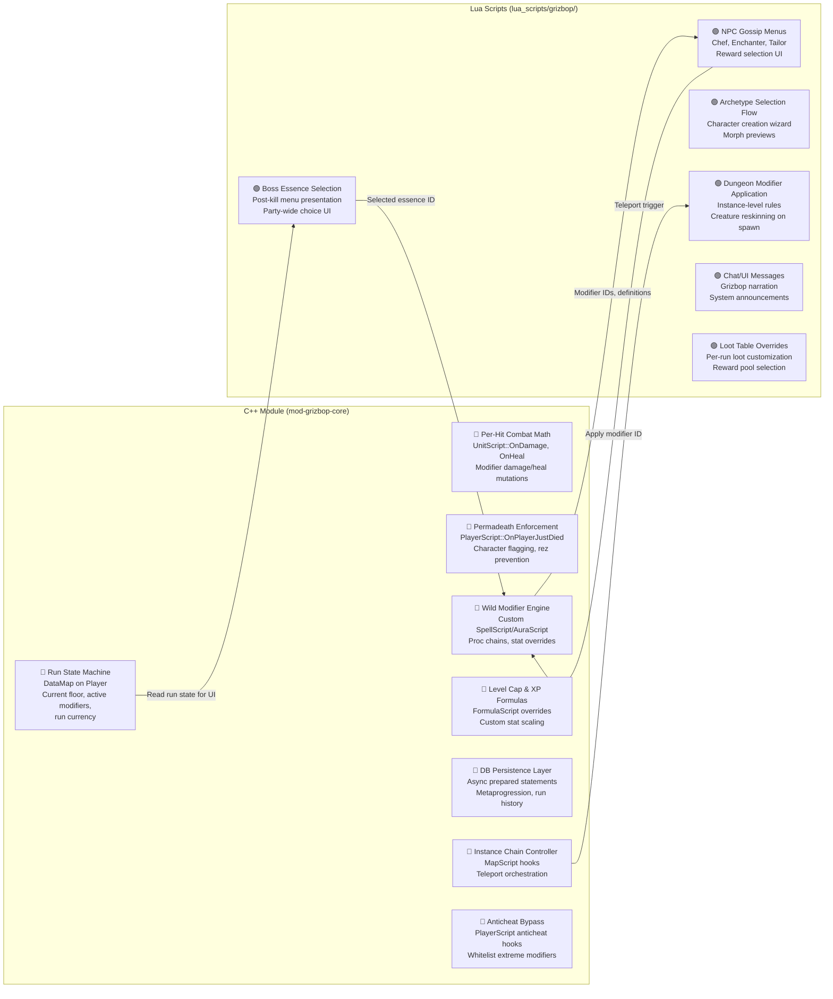

# Free Grizbop — Master Development Roadmap

> *"It's always a compromise between game design and engine reality. Let's err on the side of making a stable, performant game and just make it as fun and crazy as we can while keeping it stable."*

---

## 1. The Executive Vision

### 1.1 The Core Loop, Mapped to the Engine

Free Grizbop transforms a 2008 MMO engine into an arcade rogue-lite (see [GAME.md](../GAME.md) for full design).

```
Character Create → Archetype Selection → Dungeon Gauntlet 
→ [Boss Kill → Essence + NPC Reward → Next Dungeon] (repeat)
→ Death (Permadeath) → Metaprogression Unlocks → New Clone
```

This loop maps to AzerothCore as follows:

| Game Concept | Engine Reality |
|---|---|
| **Fresh Clone (Lv 5)** | Standard character creation, intercepted by `PlayerScript::OnFirstLogin`. C++ module overrides starting level, strips default gear, presents archetype selection. |
| **Archetype Selection** | Gossip NPC or custom packet. Applies preset talents (`Player::LearnSpell`), morph (`Player::SetDisplayId`), gear (`Player::EquipNewItem`), and writes archetype ID to `DataMap` + custom DB table. |
| **The Gauntlet** | A chain of standard `InstanceMap` objects. Each dungeon is a real AzerothCore instance with its own `InstanceScript`, spawned via `MapMgr::CreateMap()`. Players teleport between them via `Player::TeleportTo()`. |
| **Wild Modifiers** | Native C++ `AuraScript`/`SpellScript` implementations registered against custom spell entries in `acore_world.spell_dbc`. Applied to the Player object as real auras. The math runs *inside* the engine's combat pipeline, not in Lua. |
| **Boss Essence** | `UnitScript::OnUnitDeath` (C++ hook) detects boss kill → C++ module spawns a gossip NPC → Lua handles the menu presentation → C++ applies the selected aura to all party members. |
| **Permadeath** | `PlayerScript::OnPlayerJustDied` in C++ — irrevocable. Marks character as dead in DB, strips resurrection ability, fires Lua callbacks for narrative/UI, then boots to hub. |
| **Metaprogression** | Account-scoped custom tables in `acore_characters`. C++ module loads on login, persists on death/logout via async `CharacterDatabase.CommitTransaction()`. Lua reads unlocks via the C++ data bridge. |

### 1.2 The C++ / Lua Boundary — The Hard Line

This is the most important architectural decision in the project. The line is drawn based on **frequency of execution** and **criticality of state**:



**The Rule of Thumb:**

> If it fires on `OnDamage`, `OnHeal`, `OnSpellCast`, `OnAuraApply`, or any per-combat-event hook → **C++**.
> If it fires on `OnCreatureKill`, `OnGossipSelect`, `OnPlayerEnterMap`, or any one-shot event → **Lua is fine**.
> If it holds state that must survive a Lua reload → **C++ DataMap**.

### 1.3 The Modifier Engine — Why C++ is Non-Negotiable

The worst case scenario from the dilemma: 5 players × 10 modifiers each × 20 mobs × (damage + heal + proc events) = **potentially 1000+ hook invocations per second** during combat.

Each invocation through ALE involves: `LOCK_ALE` mutex acquisition → Lua stack push → `pcall` → result pop → mutex release. At ~5-10μs per invocation (optimistic), that's 5-10ms per combat tick consumed by Lua overhead alone — **10-20% of a 50ms tick budget**, and that's *before* any Lua logic executes.

**The solution:** Wild Modifiers are *real auras* with *real C++ SpellScript/AuraScript implementations*. They are registered as custom spells in the DBC/DB. The engine's existing proc system (`SPELL_AURA_PROC_TRIGGER_SPELL`, `SPELL_AURA_MOD_DAMAGE_DONE`, etc.) handles the heavy lifting at native speed. The C++ `UnitScript::OnDamage`/`OnHeal` hooks in `mod-grizbop-core` handle the *few* truly exotic modifiers that can't be expressed as standard aura effects (like "healing deals damage instead").

Lua's only job is to *select which modifier to apply* (the gossip menu), then call a C++ bridge function that adds the appropriate aura.

---

## 2. The Phased Development Roadmap

### Phase 1: The Scaffolding & MVP (Minimum Viable Playability)

> **Goal:** A single character can log in, pick an archetype, enter one dungeon, kill mobs, kill a boss, get a reward, and die permanently. The C++ module skeleton is in place and the development toolchain is validated.

#### 1A. C++ Module Skeleton (`mod-grizbop-core`)

- [ ] **Create module structure** — `CMakeLists.txt`, loader, conf, sql directories.
- [ ] **Verify build cycle** — Compile, deploy to Docker, confirm module loads (check worldserver log for `AddSC_` registration).
- [ ] **Implement `GrizbopPlayerScript`** — Register for `OnFirstLogin`, `OnLogin`, `OnLogout`, `OnPlayerJustDied`, `OnSave`.
- [ ] **Implement `GrizbopRunState` struct** — A `DataMap::Base` subclass holding: `archetypeId`, `currentFloor`, `runActive`, `runCurrency`, `modifierList`. Attached to `Player::CustomData` on login.
- [ ] **Implement `.grizbop` GM command suite** — Custom `CommandScript` for testing (see [Section 4: Next Steps](#4-next-steps)).

#### 1B. Database Foundation

- [ ] **`acore_world.grizbop_archetypes`** — `id`, `class`, `name`, `displayId`, `startLevel`, `spell_list` (comma-separated spell IDs), `item_list` (comma-separated item entries), `talent_string`.
- [ ] **`acore_characters.grizbop_character_state`** — `guid`, `accountId`, `archetypeId`, `isAlive` (bool), `currentFloor`, `runStartTime`.
- [ ] **Load archetype definitions at startup** via `WorldScript::OnLoadCustomDatabaseTable`. Cache in a static `std::unordered_map` in the module.

#### 1C. Archetype Selection (v1: Simple)

- [ ] **Spawn a "Grizbop" NPC** (creature entry in `acore_world.creature_template`) at the starting location.
- [ ] **Lua gossip script** — Present archetype choices. On selection, call a C++ bridge function (exposed via a custom chat command or a registered ALE method) that:
  - Sets `Player::SetLevel(5)`.
  - Applies the morph via `Player::SetDisplayId()`.
  - Learns spells from the archetype definition.
  - Equips starter gear.
  - Writes `archetypeId` to `DataMap` and fires an async DB write.
- [ ] **Block re-selection** — Check `DataMap` on gossip open; if archetype already set, skip menu.

#### 1D. Single Dungeon Proof-of-Concept

- [ ] **Pick one existing dungeon** (e.g., Deadmines, MapId 36) as the gauntlet test instance.
- [ ] **Lua `InstanceScript`** — Register via `INSTANCE_EVENT_ON_INITIALIZE`. Scale creature HP/damage based on party size (read via `Map:GetPlayerCount()`).
- [ ] **Teleport-in mechanism** — After archetype selection, the gossip NPC offers "Begin your run." C++ teleports the player via `Player::TeleportTo(36, x, y, z, o)`.
- [ ] **Validate party handling** — Ensure 1-5 players can enter the same instance via shared group instance binding.

#### 1E. Basic Permadeath (v1)

- [ ] **`OnPlayerJustDied` (C++)** — Set `isAlive = false` in `DataMap`, fire async DB update, prevent resurrection (override spirit healer interaction), send chat message ("Grizbop: You died. Pathetic."), teleport to hub after 5s.
- [ ] **Block dead characters** — On `OnLogin`, if `isAlive == false`, force disconnect or teleport to a "graveyard" spectator zone.

---

### Phase 2: The Rogue-Lite Engine

> **Goal:** The run state machine works end-to-end. A player can clear a dungeon, transition to the next, and the system tracks where they are. Instance chaining is validated. Memory lifecycle is clean.

#### 2A. The Run State Machine (C++)

- [ ] **Formalize `GrizbopRunState`** as a full state enum:
  ```
  IDLE → ARCHETYPE_SELECT → IN_DUNGEON → BOSS_REWARD → 
  TRANSITIONING → IN_DUNGEON → ... → DEAD → IDLE
  ```
- [ ] **Floor progression** — After boss kill, increment `currentFloor` in `DataMap`, select next dungeon from a pool.
- [ ] **Periodic DB checkpoint** — Every 60 seconds (via `WorldScript::OnWorldUpdate` with an `IntervalTimer`), batch-write all active `GrizbopRunState` objects to `acore_characters.grizbop_character_state` using `CharacterDatabase.CommitTransaction()` (async).
- [ ] **Reconnect resilience** — On `OnLogin`, if `runActive == true` in DB, restore `DataMap` from DB and teleport player back to their current dungeon.

#### 2B. Instance Chaining

> **Architectural Decision: Standard Teleportation, Not Mega-Maps.**

The "mega-map" approach (dynamically placing dungeon content in a single huge map) would require custom navmesh generation, manual creature spawning outside the `GridObjectLoader` pipeline, and breaks `InstanceScript` entirely. It's a maintenance nightmare for marginal performance gain.

**The recommended approach: Chain standard instances via teleportation.**

- [ ] **Define a dungeon pool** — `acore_world.grizbop_dungeon_pool`: `id`, `mapId`, `entranceX/Y/Z/O`, `difficulty_tier`, `boss_entry`.
- [ ] **Post-boss transition flow (C++)**:
  1. `UnitScript::OnUnitDeath` detects a boss kill (by entry ID from the pool table).
  2. C++ module sets `RunState = BOSS_REWARD`, spawns the reward NPC(s).
  3. After reward selection (Lua gossip → C++ callback), C++ sets `RunState = TRANSITIONING`.
  4. C++ selects the next dungeon from the pool (filter by `difficulty_tier <= currentFloor`).
  5. `Player::TeleportTo(nextMapId, entrance)` for all party members.
  6. `OnPlayerEnterMap` (C++) detects arrival at the new instance, sets `RunState = IN_DUNGEON`, increments `currentFloor`.
- [ ] **Instance cleanup** — The old `InstanceMap` is automatically destroyed by `MapMgr` when all players leave (standard AzerothCore behavior). No memory leak risk.
- [ ] **Pre-loading caveat** — `EnsureGridLoaded` is I/O-bound (disk reads for grid data). For our small player count, this is a ~100-500ms one-time cost per new instance. Acceptable for a 5-man rogue-lite. If it becomes noticeable, we can add a loading screen via `SMSG_TRANSFER_PENDING` + `SMSG_NEW_WORLD` packet sequencing (the client already supports this natively for normal dungeon entries).

#### 2C. Party Lifecycle Management

- [ ] **Party-scoped run state** — When a party leader starts a run, write the `runId` to all party members' `DataMap`. If a member disconnects and reconnects, they rejoin the same run.
- [ ] **Solo fallback** — If no party, the player is their own "party of one." Same state machine, no group shenanigans needed.
- [ ] **Mid-run party changes** — Decide policy: Can players join in progress? If yes, they inherit the current floor and scaling adjusts. If no, prevent `Group::AddMember()` via `GroupScript::OnAddMember` hook returning false.

#### 2D. Difficulty Scaling

- [ ] **`AllCreatureScript::OnBeforeCreatureSelectLevel` (C++)** — Intercept creature spawns in Grizbop instances (check `Map::CustomData` for a Grizbop run flag). Scale level and stats based on `currentFloor` and party size.
- [ ] **`UnitScript::OnDamage` / `UnitScript::OnHeal` (C++)** — Apply floor-based multipliers. This is a simple O(1) multiply on the existing damage/heal value — negligible performance cost.

---

### Phase 3: The Chaos Injector (Wild Modifiers & Essences)

> **Goal:** Players accumulate stacking buffs and the combat feels crazy. Custom spells exist in the DB. The C++ proc engine handles the heavy lifting. Boss essences are available party-wide.

#### 3A. Custom Spell & Aura Infrastructure

- [ ] **Reserve a Grizbop spell ID range** — e.g., `90000-99999`. These will be custom entries in `acore_world.spell_dbc` (the server-side spell data table).
- [ ] **Create "template" modifiers** as real spells:
  - **Stat modifiers** — Use `SPELL_AURA_MOD_STAT` (Aura 29). E.g., "+50 Strength" is a spell with Effect0 = SPELL_AURA_MOD_STAT, Misc0 = STAT_STRENGTH, BasePoints = 50. This is *zero-cost* at runtime — the engine handles it natively.
  - **Speed modifiers** — `SPELL_AURA_MOD_SPEED_ALWAYS` (Aura 68). A percentage multiplier.
  - **Scale modifiers** — `SPELL_AURA_MOD_SCALE2` (Aura 141) or direct `SetObjectScale()` in the AuraScript's `OnApply`.
  - **Proc-based effects** — `SPELL_AURA_PROC_TRIGGER_SPELL` (Aura 42). E.g., "10% chance on hit to cast Chain Lightning (spell 90001)." Define the trigger spell separately with the actual damage effect.
  - **Damage conversion** — Custom `AuraScript::OnEffectProc` that intercepts heal events and converts them to damage. This is the "healing does damage" modifier.
- [ ] **Register SpellScript/AuraScript pairs in mod-grizbop-core** for exotic modifiers that can't be expressed purely via DB spell data.

#### 3B. Modifier Definition Table

- [ ] **`acore_world.grizbop_modifiers`** — `id`, `spell_id` (FK to custom spell), `name`, `description`, `category` (buff/nerf/exotic), `rarity` (common/rare/legendary), `stacks` (bool), `max_stacks`, `conflicts_with` (comma-separated modifier IDs).
- [ ] **Load at startup** into a C++ `std::vector<GrizbopModifier>`. Expose to Lua as a readonly lookup.

#### 3C. Modifier Application Flow

```
Player kills boss / interacts with NPC (Lua gossip)
    └→ Lua presents menu from grizbop_modifiers table
        └→ Player selects option
            └→ Lua calls C++ bridge: ApplyGrizbopModifier(player, modifierId)
                └→ C++ resolves modifierId → spellId
                    └→ C++ calls Player::AddAura(spellId, player)
                        └→ Engine's aura system takes over
                            └→ SpellScript/AuraScript handles all proc logic at native speed
```

- [ ] **Conflict resolution (C++)** — Before applying, check player's active auras against the `conflicts_with` list. If conflict, remove the old aura first or reject.
- [ ] **Stack tracking (C++)** — Use the Aura's native `SetStackAmount()` / `GetStackAmount()` API. The `max_stacks` from the table is baked into the custom spell's DBC entry.

#### 3D. Boss Essence System

- [ ] **`acore_world.grizbop_boss_essences`** — `boss_entry`, `essence_modifier_id_1`, `essence_modifier_id_2`, `essence_modifier_id_3`.
- [ ] **On boss kill (C++)** — Look up boss entry in the essences table. Construct a list of 2-3 modifier IDs.
- [ ] **Spawn a "Soul Orb" NPC** (invisible creature with gossip) at the boss's death location.
- [ ] **Lua gossip** — Display the essence choices with modifier descriptions (read from the modifier definitions cache).
- [ ] **On select (C++ callback)** — Apply the selected modifier to ALL group members via `Group::MemberSlotList` iteration → `Player::AddAura()`.
- [ ] **Timeout** — If no choice within 30 seconds, auto-select one randomly.

#### 3E. NPC Encounter Rewards (Chef, Enchanter, Tailor)

- [ ] **Spawn mechanic** — After each boss kill (not just dungeon completion), the C++ module spawns 1 random reward NPC alongside the essence orb.
- [ ] **Lua gossip for each NPC type** — Chef offers food buffs (well-fed auras), Enchanter offers weapon enchant procs (real enchant IDs applied via `Player::ApplyEnchantment`), Tailor offers gear (item creation via `Player::AddItem`).
- [ ] **Economy integration** — Cost in run currency (tracked in `DataMap`). Currency gained from mob kills and boss kills.

---

### Phase 4: Persistence & Metaprogression

> **Goal:** Deaths feel meaningful but not punishing. Players unlock persistent benefits across runs. A hub world exists between runs.

#### 4A. Metaprogression Database Schema

- [ ] **`acore_characters.grizbop_account_meta`** — `accountId`, `totalRuns`, `bestFloor`, `totalBossKills`, `totalDeaths`, `currencyBalance` (permanent meta-currency).
- [ ] **`acore_characters.grizbop_account_unlocks`** — `accountId`, `unlockId`, `unlockedAt`. 
- [ ] **`acore_world.grizbop_unlock_definitions`** — `id`, `name`, `description`, `cost`, `type` (archetype/modifier/cosmetic), `reward_data` (JSON or structured text).

#### 4B. Persistence Engine (C++)

- [ ] **On death** — C++ module writes run summary to `grizbop_account_meta` (increment counters, update best floor) and awards meta-currency based on floor reached.
- [ ] **On login** — `AsyncQuery` loads account meta and unlocks into a `GrizbopAccountData` struct on `Player::CustomData`. Lua can read this for UI.
- [ ] **Unlock purchase** — Hub NPC (Lua gossip) displays available unlocks filtered by what the account already has. On purchase, C++ deducts meta-currency and writes the unlock to `grizbop_account_unlocks` via async transaction.

#### 4C. The Hub World

- [ ] **Caverns of Time** (Map 1, Kalimdor interior) — Confirmed hub location. Thematically "outside of time," large open area with alcoves for NPCs, existing navmesh. Spawn coords: `-8371.93, -4250.21, -204.38`. Existing Keepers of Time NPCs can be repurposed or despawned.
- [ ] **Hub NPCs** — Grizbop (main questgiver / narration, deeper in cavern ~`-8589, -4194, -208`), Meta-shop vendor, Archetype selection, "Begin Run" portal/NPC (near instance portal area).
- [ ] **Phase masking** — Dead characters are teleported here. Use `PhaseMask` to separate players who are "between runs" from those actively configuring.
- [ ] **Leaderboard** — A Lua-driven NPC or addon that queries `grizbop_account_meta` for `bestFloor` rankings.

#### 4D. Metaprogression Effects on New Runs

- [ ] **Starting bonuses** — Unlocked modifiers can appear as "starting modifier" options during archetype selection.
- [ ] **Archetype unlocks** — New archetypes become available after meeting specific conditions (e.g., "reach floor 10 with a Warrior").
- [ ] **Cosmetic rewards** — Persistent display IDs or titles (via `CharacterDatabase` title flags).

---

## 3. The "Known Unknowns" (Risk Assessment)

### 🔴 Risk 1: Client Physics & Extreme Modifiers

**The Problem:** The 3.3.5a client performs local physics prediction (movement interpolation, projectile paths, jump arcs). The server then *validates* what the client reports. When we push modifiers to extremes:

| Modifier | Client Behavior | Server Behavior | Risk |
|---|---|---|---|
| **Scale > 3.0x** | Client renders it fine | `recast/detour` navmesh uses default collision radius. Creature pathfinding ignores player size. Server LOS checks use default hitbox. | **Medium.** Mostly cosmetic — creatures won't path around you differently. |
| **Speed > 300%** | Client moves smoothly | `MovementHandler.cpp` → `AnticheatCheckMovementInfo()` may reject packets as "teleport hacks" | **High.** Rubber-banding. |
| **Low Gravity / Feather Fall** | Client applies visual fall speed change | Standard behavior via `SPELL_AURA_FEATHER_FALL`. Client sends correct fall time. | **Low.** Works natively. |
| **Extreme Jump Height** | Client calculates jump arc locally | Server may flag excessive Z-axis movement as fly-hack | **High.** Needs anticheat whitelist. |
| **Extreme Spell Range (> 100yd)** | Client allows targeting at range | Server validates range against `SpellInfo.RangeEntry.maxRange` at cast time | **Low.** If we set the custom spell's range in DB, it works. |

**Key Discovery:** AzerothCore's anticheat is **entirely module-driven** via `ScriptMgr` hooks (`AnticheatCheckMovementInfo`, `AnticheatHandleDoubleJump`, `AnticheatSetCanFlybyServer`). It is *not* hardcoded. This means:

> **Mitigation:** Our C++ module can register a `PlayerScript` that intercepts all anticheat hooks. When a player has active Grizbop modifiers, we **whitelist specific movement flag violations** based on their active speed/gravity auras. No core engine modification needed.

> [!IMPORTANT]
> **CONFIRMED starting limits:**
> - Scale: **0.3x – 5.0x** (beyond this, the client model clips through geometry)
> - Speed: **200%** cap (test 300% with the anticheat bypass)
> - Jump height: Express via `SPELL_AURA_MOD_INCREASE_MOUNTED_FLIGHT_SPEED` or similar (avoid raw Z manipulation)

### 🔴 Risk 2: Level 100 — DBC & Stat Cliff

**The Problem:** The 3.3.5a client's DBC data only defines stat curves, XP requirements, and talent points up to level 80. Levels 81-100 will have:
- No XP-to-next-level formula (client shows "??")
- No base stat scaling (HP/mana/str/agi stop increasing)
- No additional talent points (client tree maxes out)

**Mitigation Strategy:**
- **XP curve:** `FormulaScript::OnGainCalculation` in C++ handles all XP math. The client's XP bar still renders fine as long as the server sends valid `SMSG_EXPERIENCE_LOG` and `SMSG_SET_FIELD_UPDATE` packets with correct XP values.
- **Base stats:** `PlayerScript::OnPlayerLevelChanged` can manually set base stats via `Player::SetStat()` or apply invisible auras that grant flat stat increases per level.
- **Talent points:** The client tree UI maxes at 71 points (level 80). Beyond level 80, we *cannot add more talent tree points* via the standard UI. Options:
  - A. **Don't give talent points past 80.** Post-80 power comes purely from modifiers. *(Simplest.)*
  - B. **Use a custom addon** to present a "Grizbop Talent Tree" UI that sends addon messages to the server. Server applies the effects as hidden auras. *(Most flexible, most work.)*

> [!IMPORTANT]
> **CONFIRMED:** Level cap is **60** for MVP. The modifier system provides the primary power progression, not levels. Level cap extension to 80+ is a future consideration only if content demands it.

### 🔴 Risk 3: Instance Chaining Loot & Content Exhaustion

**The Problem:** AzerothCore ships with ~15 5-man dungeons per expansion tier. A good rogue-lite run might have 5-10 dungeon floors. With only 3.3.5a content, players will see repeats very quickly.

**Mitigation:**
- **Dungeon Modifiers** change the *feel* even in the same map ("all enemies are tiny," "double bosses," "darkness — reduced visibility range"). This is cheap to implement via `AllCreatureScript` hooks and visual auras on creatures.
- **Randomized creature packs** — Instead of using the dungeon's default creature spawns, clear them out via `Creature::DespawnOrUnsummon()` on instance load and spawn custom packs from a pool table. This turns a familiar dungeon into a new experience.
- **Boss rotation** — Don't use the dungeon's real bosses. Despawn them and spawn a random boss from a custom pool with a custom `CreatureAI` (written in Lua for rapid iteration).

**Target for MVP:** **5 dungeons × 4 modifier combinations = 20 distinct-feeling floors** for v1.

### 🟡 Risk 4: The Addon Gap (UI Limitations)

**The Problem:** The rogue-lite genre expects UI elements that WoW 3.3.5a doesn't natively provide:
- *Run progress tracker* (current floor, modifier list)
- *Boss essence selection overlay*
- *Meta-currency display*
- *Archetype info panel*

The standard WoW client has no LUA API for this unless we use **addon communication** (`CHAT_MSG_ADDON` / `SendAddonMessage`).

**Mitigation:**
- **v1: No addon required.** Use gossip menus (`GossipMenu::AddItem()`), NPC chat bubbles, and `SendBroadcastMessage()` / `SendSystemMessage()` for UI. Clunky, but functional and zero client-side work.
- **v2: Custom addon.** Build a lightweight AddOn (client-side Lua) that listens to `CHAT_MSG_ADDON` packets from the server (sent via `Player::SendAddonMessage()`). The server pushes run state as serialized strings, the addon renders frames. ALE can send addon messages from the server side.

> [!IMPORTANT]
> **CONFIRMED:** No custom addon for MVP. Use gossip menus and chat messages. Build the addon when the gameplay loop is validated.

---

## 4. Next Steps — Developer Tooling

The first deliverable is a **custom GM command suite** (`.grizbop`) for rapidly testing, resetting, and debugging the rogue-lite loop. See [phase_0.md](phase_0.md) for the full command tree, module structure, DB schema, and implementation sequence.

---

> **TL;DR:** Build the C++ module first. Build the GM tools second. Build the gameplay last. The engine is your friend if you use its native systems (`SpellScript`, `AuraScript`, `DataMap`, `ScriptMgr` hooks) instead of fighting them with Lua workarounds. Embrace C++. Ship stable. Make it crazy within the lines.
